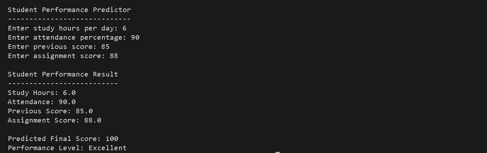

# Student Performance Predictor

A machine learning project that predicts a student's final score based on study hours, attendance, previous score, and assignment score.

## Project Overview

The Student Performance Predictor uses Linear Regression to estimate a student's final performance.

The project includes:

- Synthetic student dataset generation
- Exploratory Data Analysis (EDA)
- Linear Regression model training
- Model evaluation using R2 and MAE
- 5-fold cross-validation
- Prediction error analysis
- Interactive student score prediction

## Features

The model uses four input features:

| Feature | Description |
|---|---|
| Study Hours | Average study hours per day |
| Attendance | Attendance percentage |
| Previous Score | Student's previous academic score |
| Assignment Score | Assignment performance score |

The target variable is:

**Final Score**

## Machine Learning Model

The project uses:

**Linear Regression**

Linear Regression was selected after comparing model performance.

### Final Model Performance

- **Average R2 Score:** 0.936
- **Average MAE:** 2.247
- **R2 Standard Deviation:** 0.019
- **MAE Standard Deviation:** 0.281

The model explains approximately 93.6% of the variation in final scores during 5-fold cross-validation.

The average prediction error is approximately 2.25 points.

## Project Structure

```text
student-performance-predictor/
|
+-- data/
|   +-- students.csv
|
+-- images/
|   +-- prediction-output.png
|
+-- generate_data.py
+-- eda.py
+-- train_model.py
+-- cross_validation.py
+-- error_analysis.py
+-- predict.py
+-- predictor.py
+-- student_model.pkl
+-- README.md
```

## Dataset

The dataset contains **500 synthetic student records**.

Each record contains:

- Study hours
- Attendance
- Previous score
- Assignment score
- Final score

The dataset was generated using Python and NumPy.

## Exploratory Data Analysis

The project includes scatter plots showing the relationship between each feature and the final score.

The strongest relationship with final score was observed for:

1. Study Hours
2. Previous Score
3. Assignment Score
4. Attendance

These relationships were also examined using correlation analysis.

## Model Evaluation

The model was evaluated using:

### R2 Score

R2 measures how much of the variation in the target variable is explained by the model.

Higher values indicate better performance.

### Mean Absolute Error (MAE)

MAE measures the average absolute difference between actual and predicted scores.

Lower values indicate better performance.

### 5-Fold Cross-Validation

The final model was evaluated using 5-fold cross-validation.

| Fold | R2 | MAE |
|---|---:|---:|
| 1 | 0.911 | 2.411 |
| 2 | 0.947 | 2.159 |
| 3 | 0.926 | 2.553 |
| 4 | 0.959 | 1.817 |
| 5 | 0.935 | 2.294 |
| **Average** | **0.936** | **2.247** |

## Example

```text
Student Performance Predictor
-----------------------------

Enter study hours per day: 6
Enter attendance percentage: 90
Enter previous score: 85
Enter assignment score: 88

Student Performance Result
--------------------------
Study Hours: 6.0
Attendance: 90.0
Previous Score: 85.0
Assignment Score: 88.0

Predicted Final Score: 100
Performance Level: Excellent
```

## Sample Output



## Technologies Used

- Python
- Pandas
- NumPy
- Scikit-learn
- Matplotlib
- Joblib

## How to Run

### 1. Clone the repository

```bash
git clone https://github.com/mohammed-talha29/python-practice.git
```

### 2. Open the project folder

```bash
cd python-practice/student-performance-predictor
```

### 3. Install the required libraries

```bash
pip install pandas numpy scikit-learn matplotlib joblib
```

### 4. Generate the dataset

```bash
python generate_data.py
```

### 5. Train the model

```bash
python train_model.py
```

### 6. Run the prediction program

```bash
python predict.py
```

Enter the study hours, attendance, previous score, and assignment score when prompted.

The program will return the predicted final score and performance level.

## Future Improvements

Possible improvements include:

- Adding more real-world student data
- Trying additional machine learning algorithms
- Adding a graphical user interface
- Deploying the model as a web application
- Adding automated model retraining
- Improving prediction calibration near the 100-point limit

## Limitations

- The dataset is synthetic and may not represent real-world student performance.
- Linear Regression may not capture complex relationships between student characteristics.
- Predictions are limited to the 0-100 score range.
- The model should not be used as a real academic assessment system.

## Disclaimer

This project uses a synthetic dataset for educational purposes.

The predictions should not be considered a reliable assessment of real-world student performance.

## Author

**Mohammed Talha**

GitHub: **mohammed-talha29**